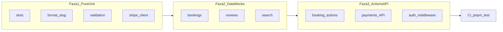

# ServisHub SK — kompletná testová sada

## Stav

- Vitest + CI krok `pnpm test` už beží (`[vitest.config.ts](vitest.config.ts)`, `[.github/workflows/ci.yml](.github/workflows/ci.yml)`).
- Jediný existujúci test: `[src/lib/booking/slots.test.ts](src/lib/booking/slots.test.ts)` (~6 caseov).
- Playwright / live DB e2e **nie** — žiadny linked Supabase; e2e pridáme až po T0 infra odblokovaní.

## Pravidlá

- Colocate `*.test.ts` vedľa kódu (už `include: ["src/**/*.test.ts"]`).
- **Nikdy** live DB / Stripe / Supabase / Resend — mock Prisma, Supabase client, Stripe SDK, `redirect` / `revalidatePath`.
- Žiadne zmeny plánového `.plan.md` súboru.

## Fáza 1 — Pure unit (bez mockov)


| Súbor                                                                                | Pokrytie                                                                                                       |
| ------------------------------------------------------------------------------------ | -------------------------------------------------------------------------------------------------------------- |
| Rozšíriť `[slots.test.ts](src/lib/booking/slots.test.ts)`                            | `isValidTime/DateString`, `zonedTimeToUtc`, DST gap, empty windows, `getNextAvailableSlot`, half-open adjacent |
| `[src/lib/format.test.ts](src/lib/format.test.ts)`                                   | `formatEur` null/EUR/`sk-SK`; `formatRating` nový vs. s počtom                                                 |
| `[src/lib/slug.test.ts](src/lib/slug.test.ts)`                                       | diakritika, hyphen trim, max 64, empty                                                                         |
| `[src/lib/validation/booking.test.ts](src/lib/validation/booking.test.ts)`           | valid/invalid date-time, max lengths                                                                           |
| `[src/lib/validation/availability.test.ts](src/lib/validation/availability.test.ts)` | end<start, overlap vs adjacent, max 14                                                                         |
| `[src/lib/validation/provider.test.ts](src/lib/validation/provider.test.ts)`         | IČO/DIČ/PSČ, businessName, categoryIds                                                                         |
| `[src/lib/validation/service.test.ts](src/lib/validation/service.test.ts)`           | price preprocess, priceTo<from, duration bounds                                                                |
| `[src/lib/stripe/client.test.ts](src/lib/stripe/client.test.ts)`                     | commission default/clamp, fee cents rounding, `getStripe()` throw bez key                                      |
| `[src/lib/data/db.test.ts](src/lib/data/db.test.ts)`                                 | `isDatabaseConfigured`, `safeDb` fallback on unset/throw                                                       |


## Fáza 2 — Data layer (mocked Prisma)


| Súbor                                                            | Pokrytie                                                                                                                                                       |
| ---------------------------------------------------------------- | -------------------------------------------------------------------------------------------------------------------------------------------------------------- |
| `[src/lib/data/bookings.test.ts](src/lib/data/bookings.test.ts)` | create OK; overlap → `BookingConflictError`; CANCELLED neblokuje; adjacent OK; `isSerializationFailure`; cancel own PENDING/CONFIRMED vs wrong owner/COMPLETED |
| `[src/lib/data/reviews.test.ts](src/lib/data/reviews.test.ts)`   | COMPLETED → review + `ratingAvg`/`ratingCount`; non-COMPLETED / duplicate / wrong customer → error                                                             |
| `[src/lib/data/search.test.ts](src/lib/data/search.test.ts)`     | filtre cez mocked `findMany`; empty pri `safeDb` fallback                                                                                                      |


Helper: malý `[src/test/mocks/prisma.ts](src/test/mocks/prisma.ts)` — in-memory `$transaction` + chainable `findMany`/`create`/`update` fakes, aby sa mock neopakoval.

## Fáza 3 — Actions / API / Auth / Middleware


| Súbor                                                                                                      | Pokrytie                                                                            |
| ---------------------------------------------------------------------------------------------------------- | ----------------------------------------------------------------------------------- |
| `[src/app/(customer)/p/[slug]/actions.test.ts](src/app/(customer)`/p/[slug]/actions.test.ts)               | unauth, zod errors, horizon, slot CONFLICT, success + email stub                    |
| `[src/app/(customer)/moje-rezervacie/actions.test.ts](src/app/(customer)`/moje-rezervacie/actions.test.ts) | cancel success/fail, DB down                                                        |
| `[src/lib/reviews/actions.test.ts](src/lib/reviews/actions.test.ts)`                                       | rating 1–5, auth, revalidate                                                        |
| `[src/app/(marketing)/waitlist-actions.test.ts](src/app/(marketing)`/waitlist-actions.test.ts)             | email zod, lead create `source=waitlist`, DB down                                   |
| `[src/app/api/payments/create-intent/route.test.ts](src/app/api/payments/create-intent/route.test.ts)`     | 503/401/400/404; reuse intent; fee + upsert                                         |
| `[src/app/api/payments/webhook/route.test.ts](src/app/api/payments/webhook/route.test.ts)`                 | signature fail; succeeded→CONFIRMED; canceled→CANCELLED; missing metadata tolerated |
| `[src/lib/auth/session.test.ts](src/lib/auth/session.test.ts)`                                             | env missing; upsert; `requireRole` redirects                                        |
| `[src/app/(auth)/actions.test.ts](src/app/(auth)`/actions.test.ts)                                         | login/signup zod; `safeNextPath` open-redirect; PROVIDER→`/pro`                     |
| `[src/app/auth/callback/route.test.ts](src/app/auth/callback/route.test.ts)`                               | missing code; exchange fail; success upsert + redirect                              |
| `[src/middleware.test.ts](src/middleware.test.ts)`                                                         | `/pro` `/admin` → login; public paths pass                                          |


## Fáza 4 — Tooling

- Pridať `@vitest/coverage-v8`; script `test:coverage`.
- V `[vitest.config.ts](vitest.config.ts)` coverage `include` na `src/lib/**` + `src/app/**/actions.ts` + `src/app/api/**` + `src/middleware.ts`; soft thresholds (lines ≥ 60 na covered globs — fail CI len ak coverage klesne pod to po naplnení suite).
- Krátka sekcia v `[docs/BACKLOG.md](docs/BACKLOG.md)` / README: ako spustiť testy; e2e = post-Supabase.

## Explicitne mimo scope

- Playwright e2e (čaká na live Supabase + seed)
- Load (k6), visual regression
- Real Stripe / Supabase integration tests

## Verifikácia

```bash
pnpm test
pnpm test:coverage
pnpm lint && pnpm typecheck && pnpm build
```

Všetky nové testy musia prejsť offline (bez `.env.local` credentials).




